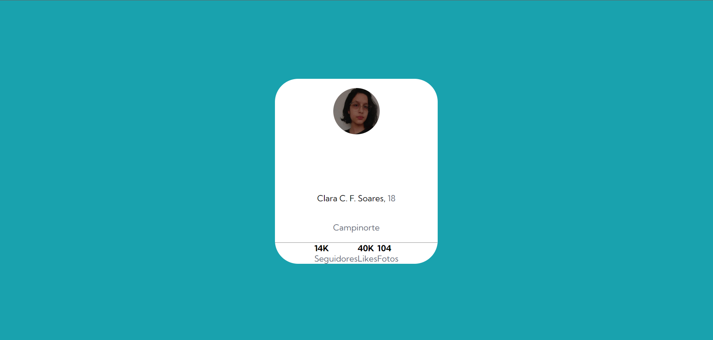

# Cartão de perfil
Desafio do FrontEnd Mentor

## O que usei?
- HTML
- CSS

## Objetivo do projeto:
Praticar capacidade de criação de HTML e CSS avançados.

## Dificuldades

A questão mais difícil p/ mim foi alinhar os dizeres do card com os números, tanto é que como podem ver, não está bem alinhado.

## Imagem do projeto

